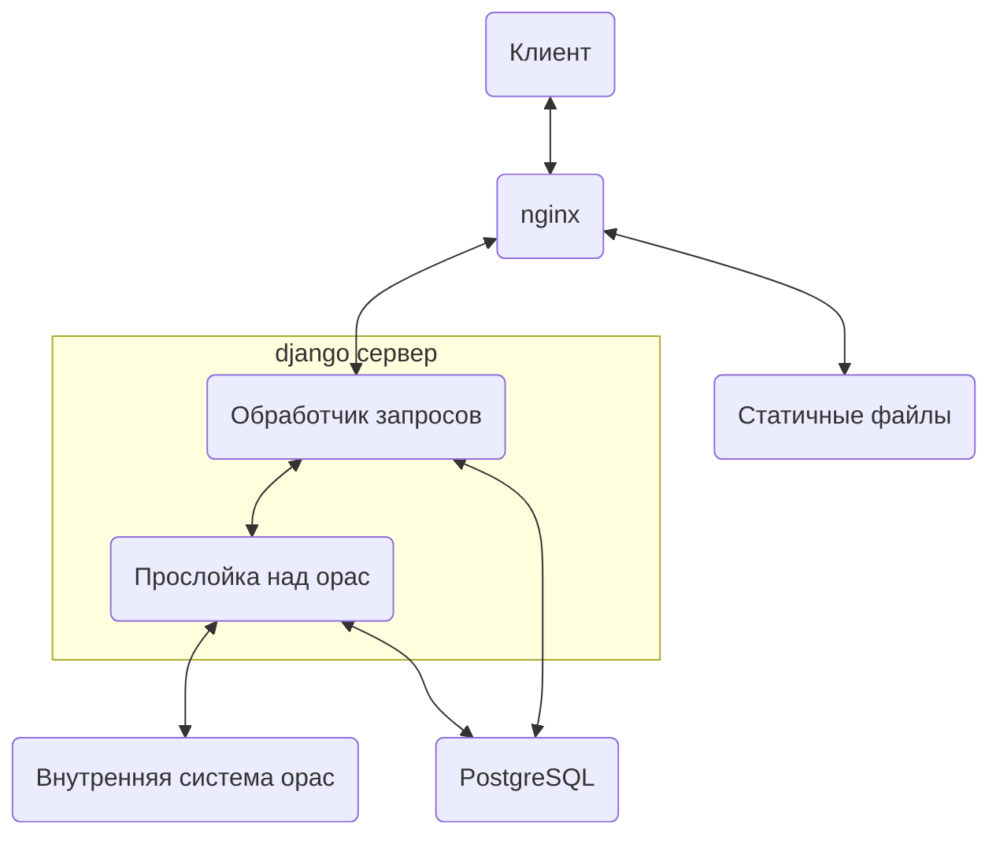
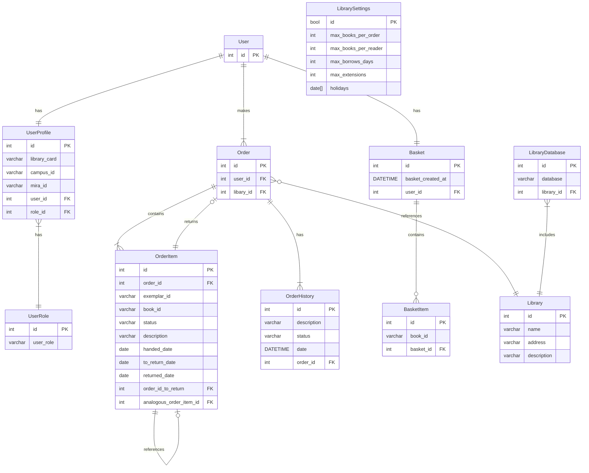

# Сервис онлайн заказа литературы

1. [Описание сервиса](#описание-сервиса)
2. [Описание проекта](#описание-проекта)
3. [Работа с проектом](#работа-с-проектом)

# Описание сервиса

Сервис позволяет через сайт производить заказ литературы из библиотек ИрНИТУ.

# Описание проекта

## Диаграмма компонентов проекта



## ER-диаграмма базы данных на сервере



# Работа с проектом

## Структура директорий проекта

В корне проекта находятся файлы, связанные с проектом в целом. В том числе к ним относится конфигурация для запуска на проде и описание Docker-контейнеров.  
Структура проекта:

- `docs` - OpenAPI документация проекта.
- `backend` - код для бэкенда на Django.
- `client` - для веб-клиента на Vue.
  - `cleint/src/api` - описание типов и функций для общения с бэкендом
  - `client/src/views` - компоненты для страниц. Каждый из данных компонентов относится к какому-то url
  - `client/src/layouts` - компоненты, используемые внутри небольшого количества страниц
  - `client/src/components` - стандартные часто используемые компоненты, такие как кнопки, текстовые поля и т.д. В отличие от компонентов в `layouts`, данные компоненты могут использоваться в большом количестве страниц и являются более низко уровневыми и неделимыми.

## Разработка проекта

### Линтинг

Для того, чтобы избежать часто встречающихся ошибок и в общем сделать код более понятным, в проекте отконфигурированы инструменты, проверяющие правильность написания кода (линтеры). Также были настроены github actions, которые автоматически запускают линтеры, и выводят предупреждения на PR, если код не соответствует правилам.

#### Бэкенд

На бэкенде используется инструмент pylint. Чтобы запустить его локально, используется команда:

```bash
pylint ./
```

#### Фронт

На фронте используется инструмент eslint. Чтобы запустить его локально, используется команда:

```bash
npm run lint
```

### Форматирование

Для того, чтобы код был стилистически единым, в проекте отконфигурированы инструменты, позволяющие автоматически форматировать код. Также были настроены github actions, которые автоматически запускают проверку, отформатирован ли код по правилам, и выводят предупреждения на PR, если код не отформатирован.

#### Бэкенд

На бэкенде используется форматирование с использованием Black (расширение в vs code: ms-python.black-formatter). Автоматически отформатировать весь проект можно командой:

```bash
black ./
```

#### Фронт

На фронте используется форматирование с использованием Prettier (расширение в vs code: esbenp.prettier-vscode). Для автоматического форматирования всего проекта используется:

```bash
npm run format
```

## Запуск приложения

### Локальный запуск

Для запуска фронтенда используется nodejs:

```sh
cd client
npm install # Установка зависимостей
npm run dev # Запуск
```

Для запуска бэкенда рекомендуется создать виртуальное окружение python, из которого сервис запускается следующим образом:

```sh
cd backend
pip install -r requirements.txt # Установка зависимостей
python manage.py runserver
```

Так же можно в директории `backend` создать файл `local_settings.py` с настройками, специфичными для вашего окружения и запускать сервер через:

```sh
python manage.py runserver --settings local_settings
```

Это, в частности, необходимо сделать, если нужно протестировать работу oauth. Тогда в файле `local_settings.py` нужно заполнить поля `OAUTH_CLIENT_ID` и `OAUTH_CLIENT_SECRET`.

### Запуск на проде

В корне необходимо создать файла `.env`, скопировав в него текст из соответствующего .example файла `.env.example`.

После этого требуется дополнительное заполнение созданного файла. Обязательным является заполнение следующих полей:

- `POSTGRES_PASSWORD` (пароль СУБД)
- `LIBRARY_PORT` (на каком порте будет хоститься сервис)
- `DJANGO_SECRET_KEY` (секретный ключ для Django).
- `DJANGO_SUPERUSER_USERNAME` (имя админского аккаунта в django)
- `DJANGO_SUPERUSER_PASSWORD` (пароль админского аккаунта в django)
- `SERVICE_HOSTNAME` (адрес сервиса, например: http://localhost:8000)
- `OAUTH_CLIENT_ID` (публичная часть oauth ключа для int.istu.edu)
- `OAUTH_CLIENT_SECRET` (приватная часть oauth ключа для int.istu.edu)
- `OPAC_INTERNAL_TOKEN` (супер-токен)

Пароль для БД рекомендуется генерировать случайно:

```sh
openssl rand -hex 32 | tr -d '\n'
```

Для генерации ключа в Django используется следующий код на Python:

```python
from django.core.management.utils import get_random_secret_key
print(get_random_secret_key())
```

При получении пары ключей oauth, для redirect_uri нужно указать значение, равное `${SERVICE_HOSTNAME}/bitrix-auth`, соотввественно, подставив ранее указанное значение вместо `${SERVICE_HOSTNAME}`.

После того, как данные файлы были заполнены, можно приступать к запуску сервиса с использованием docker compose или podman compose:

```sh
sudo docker compose build
sudo docker compose up -d
```

Сервис будет запущен на порту, указанном в `LIBRARY_PORT`
