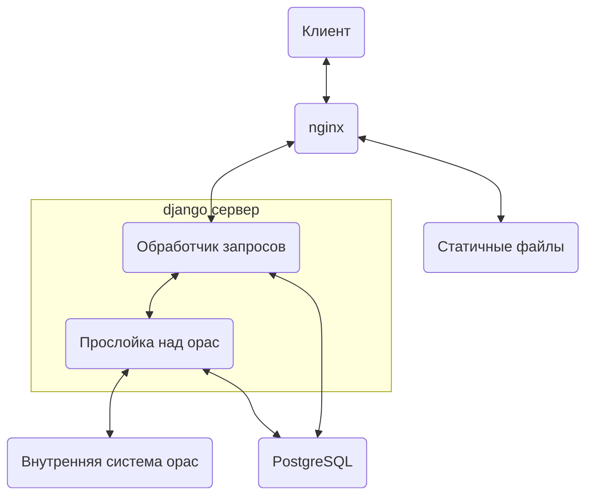
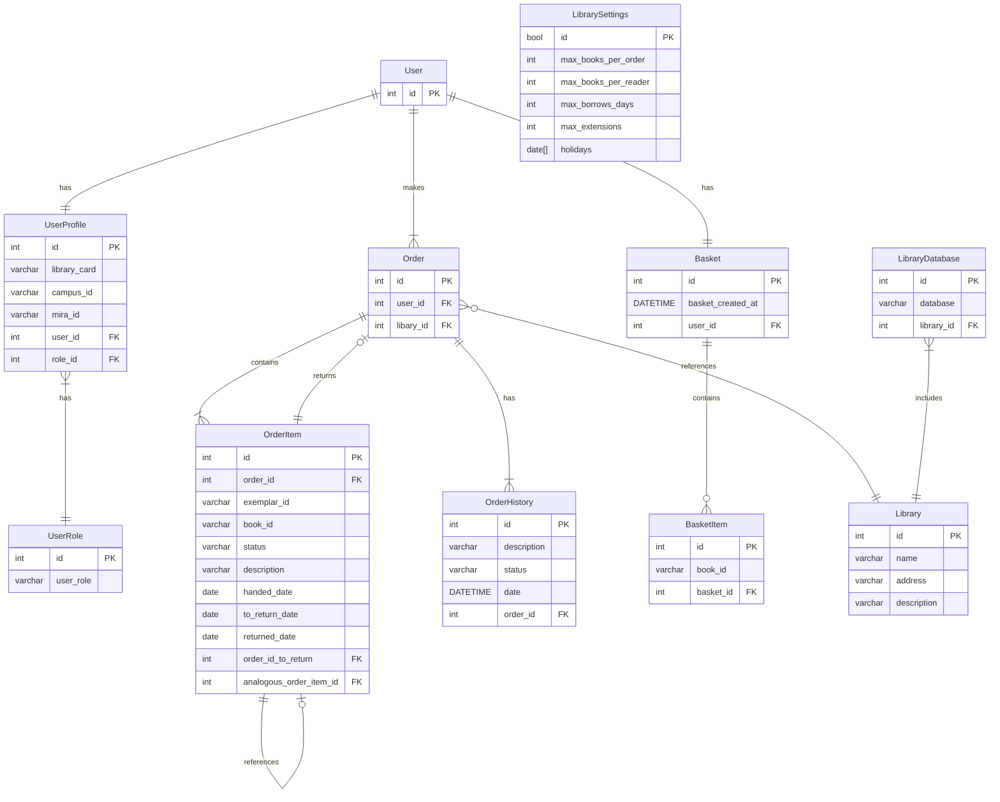

# Сервис онлайн заказа литературы

1. [Описание сервиса](#описание-сервиса)
2. [Описание проекта](#описание-проекта)
3. [Работа с проектом](#работа-с-проектом)

# Описание сервиса

Сервис позволяет через сайт производить заказ литературы из библиотек ИрНИТУ.

# Описание проекта

## Диаграмма компонентов проекта


```mermaid
graph TD
    client(Клиент) <--> nginx(nginx)
    nginx <--> staticF(Статичные файлы)
    nginx <--> handler(Обработчик запросов)
    psql(PostgreSQL) <--> handler

    subgraph django сервер
    handler <--> cacher(Прослойка над opac)
    end

    cacher <--> opac(Внутренняя система opac)
    cacher <--> psql
```

## ER-диаграмма базы данных на сервере


```mermaid
erDiagram
    User ||--|| UserProfile : has
    User ||--|{ Order : makes
    User ||--|| Basket : has
    UserProfile }|--|| UserRole : has
    Order ||--|{ OrderItem : contains
    Order ||--|{ OrderHistory : has
    Basket ||--o{ BasketItem : contains
    OrderItem ||--o| OrderItem : references
    OrderItem ||--o| Order : returns
    Order }o--|| Library : references

    LibraryDatabase }|--|| Library : includes

    User {
      int id PK
    }

    UserProfile {
      int id PK
      varchar library_card
      varchar campus_id
      varchar mira_id
      int user_id FK
      int role_id FK
    }

    UserRole {
        int id PK
        varchar user_role
    }

    Basket {
        int id PK
        DATETIME basket_created_at
        int user_id FK
    }

    BasketItem {
        int id PK
        varchar book_id
        int basket_id FK
    }

    Order {
        int id PK
        int user_id FK
        int libary_id FK
    }

    OrderHistory {
        int id PK
        varchar description
        varchar status
        DATETIME date
        int order_id FK
    }

    OrderItem {
        int id PK
        int order_id FK
        varchar exemplar_id
        varchar book_id
        varchar status
        varchar description
        date handed_date
        date to_return_date
        date returned_date
        int order_id_to_return FK
        int analogous_order_item_id FK
    }

    Library {
        int id PK
        varchar name
        varchar address
        varchar description
    }

    LibraryDatabase {
        int id PK
        varchar database
        int library_id FK
    }

    LibrarySettings {
        bool id PK
        int max_books_per_order
        int max_books_per_reader
        int max_borrows_days
        int max_extensions
        date[] holidays
    }
```

# Работа с проектом

## Структура директорий проекта

В корне проекта находятся файлы, связанные с проектом в целом. В том числе к ним относится конфигурация для запуска на проде и описание Docker-контейнеров.  
Структура проекта:

- `docs` - OpenAPI документация проекта.
- `backend` - код для бэкенда на Django.
- `client` - для веб-клиента на Vue.
  - `cleint/src/api` - описание типов и функций для общения с бэкендом
  - `client/src/views` - компоненты для страниц. Каждый из данных компонентов относится к какому-то url
  - `client/src/layouts` - компоненты, используемые внутри небольшого количества страниц
  - `client/src/components` - стандартные часто используемые компоненты, такие как кнопки, текстовые поля и т.д. В отличие от компонентов в `layouts`, данные компоненты могут использоваться в большом количестве страниц и являются более низко уровневыми и неделимыми.

## Разработка проекта

### Линтинг

Для того, чтобы избежать часто встречающихся ошибок и в общем сделать код более понятным, в проекте отконфигурированы инструменты, проверяющие правильность написания кода (линтеры). Также были настроены github actions, которые автоматически запускают линтеры, и выводят предупреждения на PR, если код не соответствует правилам.

#### Бэкенд

На бэкенде используется инструмент pylint. Чтобы запустить его локально, используется команда:

```bash
pylint ./
```

#### Фронт

На фронте используется инструмент eslint. Чтобы запустить его локально, используется команда:

```bash
npm run lint
```

### Форматирование

Для того, чтобы код был стилистически единым, в проекте отконфигурированы инструменты, позволяющие автоматически форматировать код. Также были настроены github actions, которые автоматически запускают проверку, отформатирован ли код по правилам, и выводят предупреждения на PR, если код не отформатирован.

#### Бэкенд

На бэкенде используется форматирование с использованием Black (расширение в vs code: ms-python.black-formatter). Автоматически отформатировать весь проект можно командой:

```bash
black ./
```

#### Фронт

На фронте используется форматирование с использованием Prettier (расширение в vs code: esbenp.prettier-vscode). Для автоматического форматирования всего проекта используется:

```bash
npm run format
```

## Запуск приложения

### Локальный запуск

Для запуска фронтенда используется nodejs:

```sh
cd client
npm install # Установка зависимостей
npm run dev # Запуск
```

Для запуска бэкенда рекомендуется создать виртуальное окружение python, из которого сервис запускается следующим образом:

```sh
cd backend
pip install -r requirements.txt # Установка зависимостей
python manage.py runserver
```

Так же можно в директории `backend` создать файл `local_settings.py` с настройками, специфичными для вашего окружения и запускать сервер через:

```sh
python manage.py runserver --settings local_settings
```

Это, в частности, необходимо сделать, если нужно протестировать работу oauth. Тогда в файле `local_settings.py` нужно заполнить поля `OAUTH_CLIENT_ID` и `OAUTH_CLIENT_SECRET`.

Можно сгенерировать тестовые данные
```
python manage.py generate_test_data
```
можно добавить --flush, чтобы почистить старые
```
python manage.py generate_test_data --flush
```


### Запуск через Docker

Проект поддерживает два режима запуска через Docker:
- **Dev** (разработка) - фронтенд с hot-reload на Vite, бэкенд с автоперезагрузкой, PostgreSQL на отдельном порту
- **Prod** (продакшен) - фронтенд собирается в статику и раздается через nginx, бэкенд через uvicorn с несколькими workers

#### Конфигурация .env

В корне необходимо создать файл `.env`, скопировав в него текст из `.env.example`:

```sh
cp .env.example .env
```

После этого требуется заполнение созданного файла. Обязательными являются следующие поля:

**Основные настройки:**
- `POSTGRES_PASSWORD` - пароль PostgreSQL (генерируется случайно)
- `DJANGO_SECRET_KEY` - секретный ключ для Django (генерируется случайно)
- `DJANGO_SUPERUSER_USERNAME` - имя админского аккаунта в Django
- `DJANGO_SUPERUSER_PASSWORD` - пароль админского аккаунта в Django

**Настройки портов:**
- `POSTGRES_PORT` - порт PostgreSQL для dev окружения (по умолчанию 5433, чтобы избежать конфликта с локальной БД)
- `BACKEND_PORT` - порт Django для dev окружения (по умолчанию 8000)
- `FRONTEND_PORT` - порт Vite для dev окружения (по умолчанию 5173)
- `LIBRARY_PORT` - порт nginx для prod окружения (по умолчанию 5173 для совместимости с OAuth)

**Настройки сервиса:**
- `SERVICE_HOSTNAME` - адрес сервиса без схемы, например: `localhost`
- `SERVICE_CSRF_HOSTNAME` - полный адрес для CSRF, например: `http://localhost:5173` (обязательно с `http://` или `https://`)
- `OPAC_HOSTNAME` - адрес внутренней системы OPAC: `https://library.istu.edu/opac`

**OAuth настройки:**
- `OAUTH_CLIENT_ID` - публичная часть OAuth ключа для int.istu.edu
- `OAUTH_CLIENT_SECRET` - приватная часть OAuth ключа для int.istu.edu
- `OPAC_INTERNAL_TOKEN` - супер-токен для доступа к OPAC

**Генерация случайных значений:**

Пароль для БД:
```sh
openssl rand -hex 32 | tr -d '\n'
```

Ключ для Django:
```python
from django.core.management.utils import get_random_secret_key
print(get_random_secret_key())
```

**Важно про OAuth redirect_uri:**

Приложение использует `window.location.origin` для формирования OAuth redirect URI во время выполнения. Это означает, что redirect_uri автоматически подстраивается под текущий адрес (localhost:5173, localhost:8080, и тд).

#### Запуск Dev окружения

Для локальной разработки используйте make-команды:

```sh
# Первый запуск (создаст .env => cp .env.example .env (супер секретные поля пишем сами, возможно нужно будет перезапустить), соберет и запустит контейнеры)
# 
make dev

# Последующие запуски без пересборки
make up

# Просмотр логов
make logs

# Перезапуск
make restart

# Остановка
make down

# Полная очистка (удаляет volumes и images)
make clear
```

После запуска доступны:
- Frontend: http://localhost:5173 (или значение `FRONTEND_PORT`)
- Backend API: http://localhost:8000 (или значение `BACKEND_PORT`)
- Django Admin: http://localhost:8000/admin
- PostgreSQL: localhost:5433 (или значение `POSTGRES_PORT`)

В dev режиме:
- Фронтенд запускается с Vite dev server с hot-reload
- Бэкенд использует `runserver` с автоперезагрузкой
- Код монтируется через volumes, изменения применяются сразу
- PostgreSQL доступен на отдельном порту

#### Запуск Prod окружения

Для продакшен-сборки используйте make-команды с суффиксом `-prod`:

```sh
# Первый запуск (соберет и запустит)
make prod

# Последующие запуски без пересборки
make up-prod

# Просмотр логов
make logs-prod

# Перезапуск
make restart-prod

# Остановка
make down-prod

# Полная очистка
make clear-prod
```

После запуска сервис доступен на порту из `LIBRARY_PORT` (по умолчанию 5173).

В prod режиме:
- Фронтенд собирается в статику и раздается через nginx
- Бэкенд запускается через uvicorn с 4 workers
- Включено gzip сжатие статики
- Настроено кеширование статических файлов (1 год)
- Все сервисы работают от non-root пользователя
- Логи ротируются (max 10MB × 3 файла)

#### Ручной запуск через docker compose

Если не хотите использовать Makefile:

```sh
# Dev
docker compose -f docker-compose.yml -f docker-compose.dev.yml up -d --build

# Prod
docker compose -f docker-compose.yml -f docker-compose.prod.yml up -d --build
```
